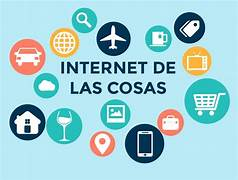

# IoT -El Internet de las cosas
## Fundamentos IoT

Esta presentación proporciona una visión general completa de IoT, destacando su definición, funcionamiento y aplicaciones.

## Impacto de las IoT

El impacto del Internet de las coasa en la vida cotidiana, razonamiento y analisis de un problema actual que puede ser resuelto atravez de la aplicaion de IoT.