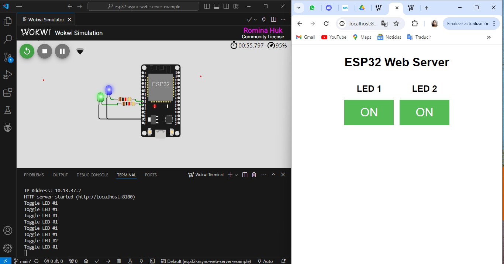

# TP#1 - Proyecto Inicial

Utilizacion de VSCode con la utilizacion de las extenciones PlatformIO y WOKWI.

## Ejemplo de servidor HTTP ESP32

Ejemplo de servidor web asíncrono ESP32: controle 2 LED desde una página web alojada en el ESP32 utilizando ESPAsyncWebServer .

## Simulacion

