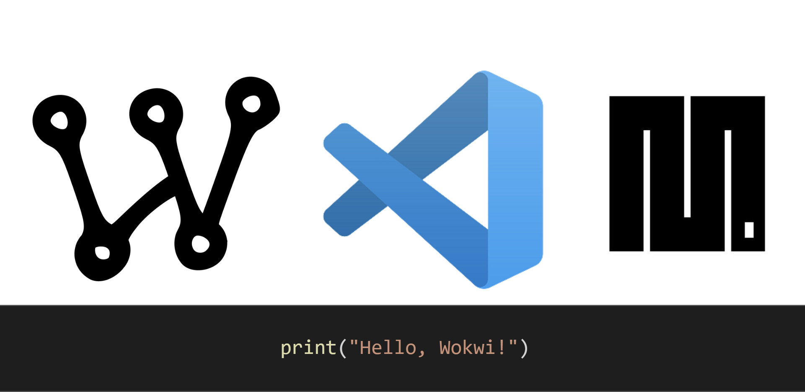

## 
Prototipo

En la siguiente carperta se presenta el desarrolo del "Trabajo Practico N° 2", se trabajo en la simulacion en *Wokwi* y Micropython.

En cada una las carpetas se encontrara, distintos archivos, que hacen al desarrollo de cada ejercicio propuesto.

- Diagrama en Json.
- Codigo fuente en MicroPython - Main.py
- Archivo de texto, con la direccion, donde se encuentra el proyecto alojado en wokwi.
- Captura de pantalla del ejercicio resuelto, mostrando el funcionamiento correcto.