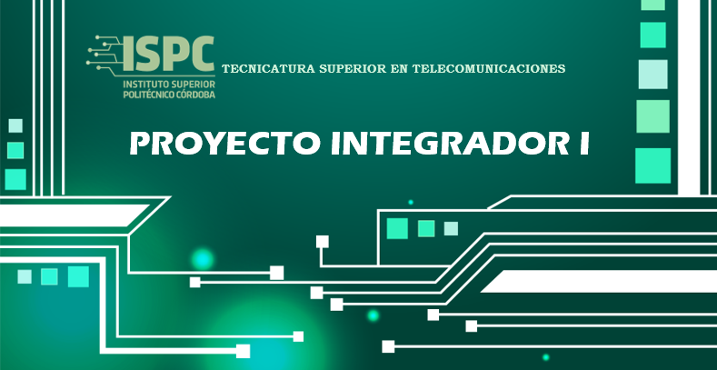

## 
TRABAJO PRACTICO N° 2 - Fundamentos de Programacion Iot y Modulos de Desarrollo

El siguiente archivo "Trabajo Práctico 12 - SFundamentos de Programacion Iot y Modulos de Desarrollo" representa una oportunidad esencial para aplicar los conocimientos teóricos en la materia Proyecto Integrador I, por medio de la Investigacion de los conceptos y elementos relacionados, para llevarlo a la Practica.

### 
  
       - Materia: Proyecto Integrador I.
       - Docente: Vera Cristian Gonzalo
       - Alumno/a: Huk Romina 

## Objetivos

1. Entender y aplicar los fundamentos de la programación en Arduino y MicroPython en el contexto de IoT, enfocándose en el manejo de entradas y salidas digitales y analógicas.
2. Desarrollar habilidades prácticas en el uso de módulos de desarrollo y shields para ESP32, explorando diversas aplicaciones de los módulos en proyectos IoT.
3. Implementar controladores básicos utilizando ESP32, que gestionen efectivamente entradas y salidas tanto digitales como
analógicas.
4. Familiarizarse con las herramientas de desarrollo como PlatformIO y RT-Thread en Visual Studio Code y utilizar la simulación en Wokwi para validar los programas desarrollados.

## Organización

- ### A - Requisitos. 
En esta carpeta se encontrara las consignas propuestas por el profesor de la materia Proyecto Integrador I, donde se detalla, los Objetivos, Fundamentos, Investigacion y organizacion del desarrollo del mismo.

- ### B - Investigacion.
En esta carpeta constara con la investigacion pertinente de cada alumno, a modo de guia para la resolucion del proyecto.

- ### C - Prototipo
En esta carpeta, se desarrollara el proyecto en si, en la caul de incluira dististas formas de presentar el mismo, archivos PFD, diseño y  simulaciones, los calculos teoricos correspondientes, la comparacion entre los valores teoricos y los resultados de la simulacion, y las conclusiones obtenidas.

Como adicional, cada carpeta estara acompañada por un archivo README, el cual será una descripcion breve de los contenidos de cada carpeta. Tambien se encontrara una carpeta "src" que contendra recursos visuales, imagenes.