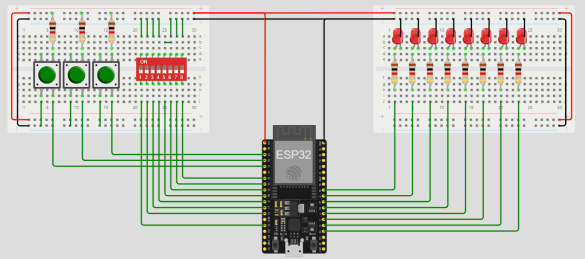
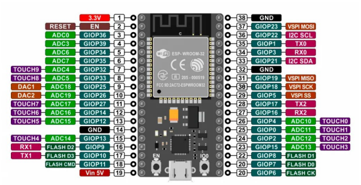

# 
PROYECTO INTEGRADOR

## TP#3 Transductores binarios

### 
  
       - Docente: Vera Cristian Gonzalo
       - Alumno/a: Huk Romina 

### Objetivos  
- Practicas con el framework de Arduino en VsCode 
- Primera aproximación a un entrenador básico 
- Practica con sensores y actuadores digitales 
-  Primera aproximación a un controlador 

 ### Desarrollo 
 Sea el siguiente entrenador digital:    Definimos: 

   

__Pulsadores__ 
- __btn1 (Pulsador 1):__ Conectado al pin GPIO34. 
- __btn2 (Pulsador 2):__ Conectado al pin GPIO39. 
- __btn3 (Pulsador 3):__ Conectado al pin GPIO36.

__Dip Switch__
- __sw1.1 (Posición 1 del Dip Switch):__ Conectado al pin GPIO13. 
- __sw1.2 (Posición 2 del Dip Switch):__ Conectado al pin GPIO12. 
- __sw1.3 (Posición 3 del Dip Switch):__ Conectado al pin GPIO14. 
- __sw1.4 (Posición 4 del Dip Switch):__ Conectado al pin GPIO27. 
- __sw1.5 (Posición 5 del Dip Switch):__ Conectado al pin GPIO26. 
- __sw1.6 (Posición 6 del Dip Switch):__ Conectado al pin GPIO25. 
- __sw1.7 (Posición 7 del Dip Switch):__ Conectado al pin GPIO33. 
- __sw1.8 (Posición 8 del Dip Switch):__ Conectado al pin GPIO32.   

### LEDs 
- __led1 (LED 1):__ Conectado al pin GPIO18. 
- __led2 (LED 2):__ Conectado al pin GPIO5. 
- __led3 (LED 3):__ Conectado al pin GPIO17. 
- __led4 (LED 4):__ Conectado al pin GPIO16. 
- __led5 (LED 5):__ Conectado al pin GPIO4. 
- __led6 (LED 6):__ Conectado al pin GPIO0. 
- __led7 (LED 7):__ Conectado al pin GPIO2. 
- __led8 (LED 8):__ Conectado al pin GPIO15. 
 
Además, tener en cuenta que el pinout se refiere al modelo ESP32 WROOM de 38 pines.  
 
   
  
## Ejercicios a resolver:   Nivel Principiante  

__Ejercicio 1: Encender un LED__ 
- Enciende el led1 conectado al GPIO18 de forma continua.  

__Ejercicio 2: Parpadeo de un LED__ 
- Programa el led1 para que parpadee con un intervalo de 1 segundo. 

__Ejercicio 3: Secuencia de LEDs__
- Crea una secuencia que encienda los LEDs del led1 al led3 de forma sucesiva, cada uno durante 500ms.  

__Ejercicio 4: Control de LED con botón__ 
- Usa el btn1 para encender el led1 mientras se mantenga presionado.  

## Nivel Intermedio  

__Ejercicio 5: Uso de botón con estado__ 
- Cambia el estado del led1 cada vez que se presione y suelte el 
btn1.

__Ejercicio 6: Debounce de botón__ 
- Implementa una lógica de debounce en el btn1 para evitar lecturas erróneas.  

__Ejercicio 7: Control de múltiples LEDs con botones__
- Usa btn1 y btn2 para controlar el estado de led1 y led2 respectivamente.

__Ejercicio 8: Uso de dip switches para control de LEDs__ 
- Lee el estado de los dip switches sw1.1 a sw1.8 y refleja el estado en los led1 a led8. 

## Nivel Avanzado  
__Ejercicio 9: Secuencia de LEDs con botón__ 

- Crea una secuencia de luces que avance cada vez que se presione btn1.  

__Ejercicio 10: Control de velocidad de parpadeo con dip switch__ 
- Utiliza los dip switches sw1.1 a sw1.3 para controlar la velocidad 
de parpadeo de led1, asignando distintas velocidades. 

__Ejercicio 11: Patrón de parpadeo de LEDs con dip switches__ 
- Establece un patrón de parpadeo para los led1 a led8 basado en la combinación de estados de sw1.1 a sw1.4. Por ejemplo, cada posición activa del switch puede representar un patrón diferente (como parpadeo rápido, lento, secuencial, etc.). 

__Ejercicio 12: Medidor de pulsaciones__ 
- Programa un contador de pulsaciones utilizando btn1. El número de pulsaciones debe mostrarse en una secuencia de LEDs (por ejemplo, led5 a led8 donde cada LED representa una cantidad de pulsaciones).  

__Ejercicio 13: Contraseña con botones__
- Implementa un sistema de contraseña usando btn1, btn2, y btn3 donde una secuencia específica de pulsaciones activa led1. Si la secuencia es incorrecta, led2 debería encenderse.

__Ejercicio 14: Aplicación de timers para control de LEDs__ 
- Utiliza el temporizador del ESP32 para controlar el parpadeo de led1 a led4 sin usar la función delay(), permitiendo que el programa ejecute otras tareas mientras los LEDs parpadean.  

__Ejercicio 15: Control de LEDs mediante comunicación serial__ 
- Escribe un programa que reciba comandos a través del puerto serie para controlar los LEDs. Por ejemplo, enviar '1' podría encender led1, '2' apagar led2, etc.  

__Ejercicio 16: Secuencia de luces de emergencia__ 
- Simula luces de emergencia con los LEDs, donde led1 y led2 parpadean alternativamente en un patrón rápido, mientras que led3 y led4 lo hacen en un patrón más lento.